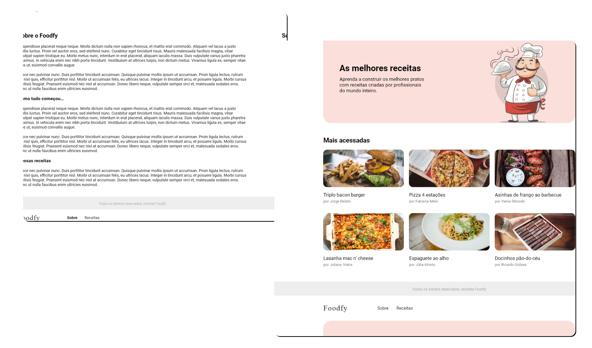

<p align="center" >

<a href="https://www.linkedin.com/in/urquiza-n%C3%B3brega-b999a1105/"></a>
</p>
<h1 align="center">Foodfy</h1>
<p align="center">Aqui você encontra as melhores receitas criadas pelos melhores profissionais do mundo! 😋</p>

<h5 align="center"> 🚀 Projeto finalizado 🚀 </h5>

Tabela de conteúdos
=================
<!--ts-->
   * [Telas](#telas)
   * [Funcionalidades](#funcionalidades)
   * [Tecnologias utilizadas](#tecnologias-utilizadas)
   * Instalação
      * [Pré requisitos](#pré-requisitos)
      * [Server](#server)
      * [Web](#web)
      * [Mobile](#mobile)
<!--te-->

## Telas



## Funcionalidades
- Na tela home você encontra os pratos mais acessados
- Na tela "Sobre" você conhecerá um pouco sobre nossa história
- Na tela receitas você encontra todos os pratos criado pelos melhores profissionais do mundo!
- Ao clicar em uma receita você verá:
  - Ingredientes
  - Modo de preparo
  - Informações adicionais

## Tecnologias utilizadas
- [x] HTML
- [x] CSS
- [x] JavaScript
- [x] NodeJS
- [x] Nunjucks
- [x] Express

## Instalação

### Pré-requisitos
Você precisa ter instalado em sua máquina as seguintes ferramentas:
- [Git](https://git-scm.com)
- [Node.js](https://nodejs.org/en/) 

### 🎲 Clonando o repositório

```bash
# Clone este repositório
$ git clone <https://github.com/UrquizaN/foodfy>

# Acesse a pasta do projeto no terminal/cmd
$ cd foodfy
```

### 🌐 Configurando e rodando

```bash
# Instale as dependências
$ npm install
ou
$ yarn install

# Executar o servidor
$ npm start
ou 
$ yarn start

# O projeto inciará na porta:5000 - acesse <http://localhost:5000>
```

<p>Projeto <strong>Foodfy</strong> foi um desafio proposto durante o Launchbase da <a  href="https://rocketseat.com.br">Rocketseat</a>. Ministrado por <a href="https://github.com/maykbrito"> Myke Brito </a></p>


<h3 align="center">
💻 Desenvolvido por: Urquiza Nóbrega
</h3>
